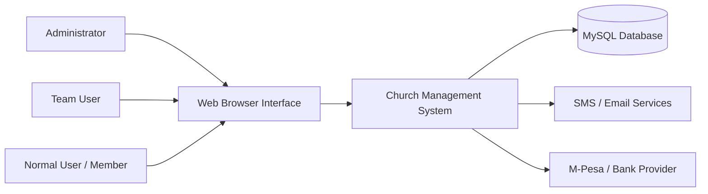
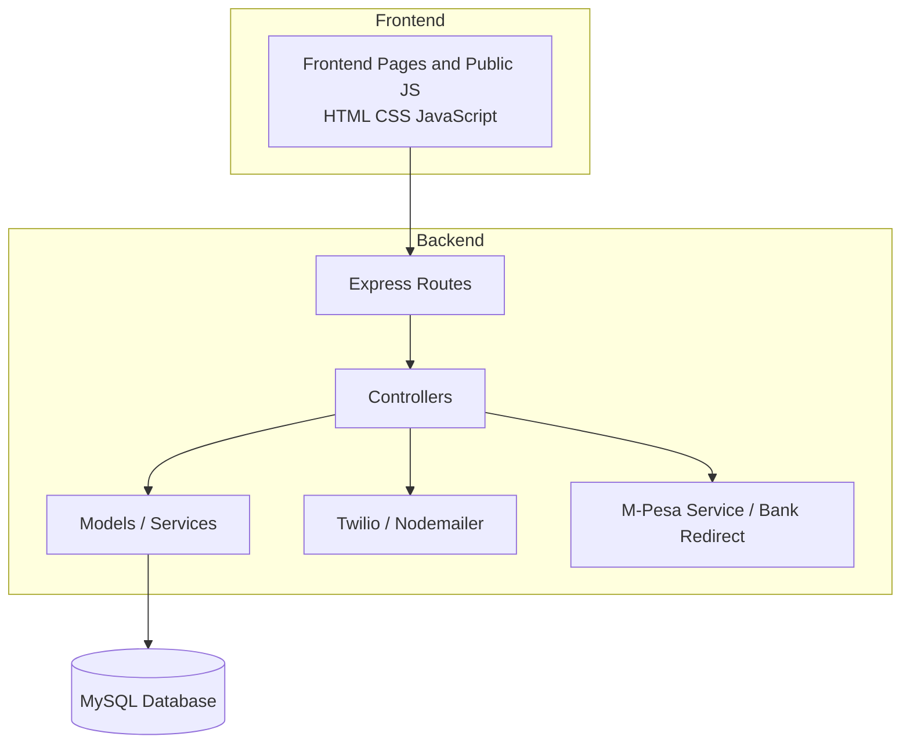
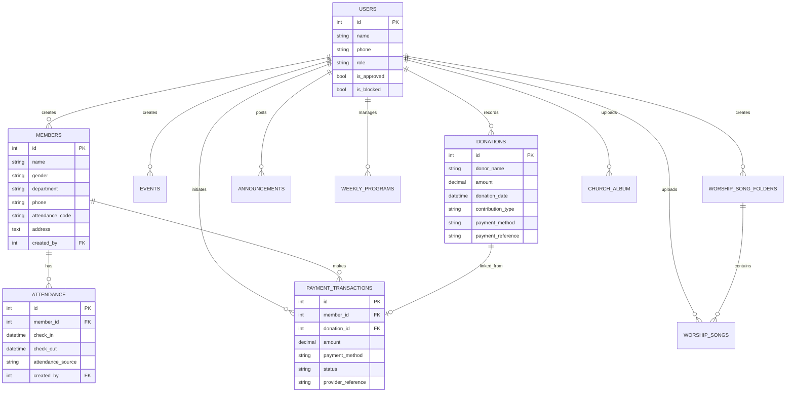
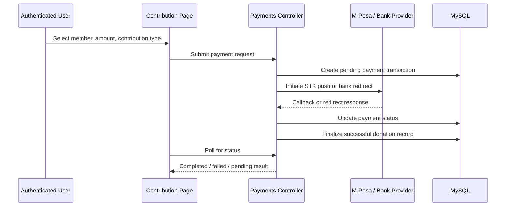
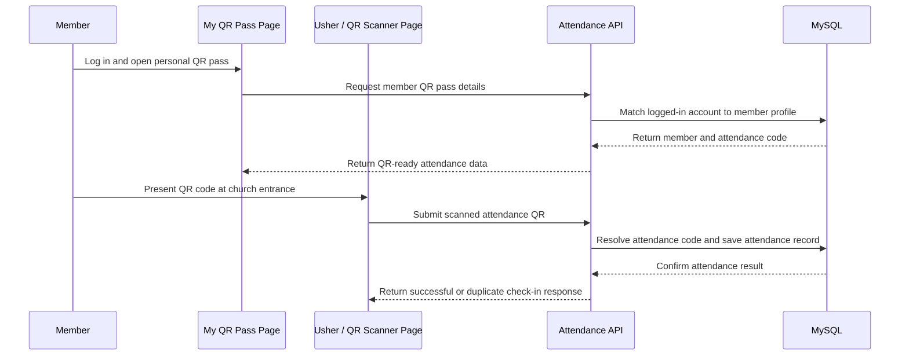

# Church Management System Project Documentation

## 1. Introduction

The Church Management System is a web-based information system developed to support the day-to-day administrative, operational, and communication needs of a church. The project centralizes member records, attendance, QR-based attendance access, contributions, events, announcements, weekly programs, worship resources, church album media, and controlled user access within one platform.

The project addresses a common challenge in many churches where records are kept manually, communication is fragmented, and reporting is slow. By digitizing these processes, the system improves efficiency, accountability, transparency, and access to timely information for ministry leaders and authorized users.

The system serves three main user groups:

- **Administrators**, who manage the full platform, approve users, and monitor records.
- **Team users**, who support operational work such as attendance, events, contribution management, and content updates.
- **Normal users or members**, who mainly consume approved information such as announcements, weekly programs, contribution pages, worship resources, and personal attendance reports.

### Objectives of the Project

The project was developed with the following objectives:

- To centralize church records in one digital platform.
- To reduce paperwork, duplication, and manual errors.
- To improve monitoring of attendance, contributions, programs, and membership data.
- To reduce attendance-marking delay through faster QR-supported member check-in.
- To strengthen communication through announcements and messaging support.
- To provide role-based access control for better accountability and security.
- To support better reporting and decision-making for church leadership.
- To create a practical foundation that can later support more automation and intelligent analytics.

## 2. Problem Definition

Many churches still manage their activities using notebooks, spreadsheets, verbal coordination, and separate messaging tools. This creates several operational problems.

### 2.1 Fragmented Member Records

Member information is often stored in different places, making it difficult to maintain accurate details such as names, departments, phone numbers, gender, and addresses. Updating records becomes slow and error-prone.

### 2.2 Poor Attendance Tracking

Attendance is commonly recorded on paper or through inconsistent methods. This makes it difficult to identify participation trends, evaluate member commitment, or generate summaries for planning and pastoral follow-up. In high-volume services, manual marking also increases congestion and slows entry.

### 2.3 Weak Financial Visibility

Contributions and donations may be captured manually, which makes it difficult to monitor totals, categories, payment methods, and history. Without a reliable record, leadership may struggle to make timely financial decisions.

### 2.4 Slow Communication and Coordination

Announcements, weekly programs, and event updates are often shared through disconnected channels. This reduces consistency, increases repetition, and makes it harder to keep members informed.

### 2.5 Limited Reporting and Decision Support

Without a digital platform, it is difficult to generate clear reports on attendance, departments, member activity, and contributions. This weakens strategic planning and ministry follow-up.

### 2.6 Lack of Controlled Access

When records are shared informally without defined permissions, there is a higher risk of unauthorized edits, accidental data loss, and poor accountability.

### 2.7 Limited Integration with Modern Services

Traditional record-keeping methods do not easily support digital payments, reusable worship media libraries, photo archives, or automated communication services that modern church operations increasingly need.

Because of these challenges, a centralized church management platform became necessary.

## 3. Project Definition, Scope, and Justification

This section aligns the project with the progress-stage guideline by clearly defining scope, relevance, and innovation.

### 3.1 Project Scope

The project focuses on the analysis, design, development, and validation of a church management information system that supports:

- User registration, approval, login, and role-based access.
- Member registration, editing, deletion, and department organization.
- Attendance marking, reporting, and visualization.
- QR-assisted attendance scanning and member self-service QR retrieval.
- Event creation and listing.
- Donation and contribution tracking.
- Live payment support through M-Pesa STK push and bank redirect flows.
- Announcements and messaging support.
- Weekly program management.
- Worship song foldering and media uploads.
- Church album image management.
- Dashboard summaries and downloadable reports.
- Member access to personal attendance pass details, including QR code and unique attendance code.

The scope also now includes a dedicated **media library extension** with two user-facing content features:

- **Worship Songs Library:** Sunday service folders, audio upload, in-browser playback, download support, and role-based management.
- **Church Album:** photo-wall display, image upload, grouped browsing, full-image open actions, download support, and role-based management.

### 3.2 User Analysis

#### Administrators

Administrators require full control over the system. They are responsible for:

- Creating and managing users.
- Approving or blocking accounts.
- Viewing all modules and records.
- Managing members, attendance, announcements, events, contributions, payments, and weekly programs.
- Creating worship-song service folders and supervising media access.
- Uploading and deleting worship songs and church album images.
- Monitoring dashboards and reports.
- Using QR attendance tools to support faster entrance check-in where needed.

#### Team Users

Team users require operational access but not full administrative control. They are expected to:

- Work with member records.
- Mark attendance.
- Use QR scanning tools to capture attendance quickly.
- Manage events and approved content modules.
- Support contributions and weekly program updates.
- Upload and delete worship songs inside admin-created folders.
- Upload and delete church album images where permitted.

#### Normal Users / Members

Normal users need a simpler experience focused on visibility rather than administration. Their main needs include:

- Viewing announcements and weekly programs.
- Accessing contribution pages.
- Opening their own attendance report.
- Opening their own attendance QR pass and unique attendance code.
- Browsing worship songs by Sunday service folder.
- Streaming or downloading worship audio without management privileges.
- Browsing, opening, and downloading church album images in view-only mode.
- Using the system without access to sensitive administrative controls.

### 3.3 Functional Requirements

The system was expected to provide the following functions:

1. User registration and login.
2. Role-based dashboards.
3. Member creation, editing, deletion, and department assignment.
4. Attendance capture, QR scanning, and reporting.
5. Event creation and listing.
6. Contribution recording and category tracking.
7. Live digital payment initiation and status tracking.
8. Announcement management and communication support.
9. Weekly program management.
10. Worship-song service folder creation with one folder per Sunday service date.
11. Worship-audio upload, playback, download, and deletion based on role permissions.
12. Church-album image upload, grouped viewing, open, download, and deletion based on role permissions.
13. Member self-service QR pass viewing, code retrieval, and QR download.
14. Downloadable attendance or content-related reports.
15. Database migration support for reliable setup and upgrades.

### 3.4 Non-Functional Requirements

The system also needed to satisfy non-functional requirements such as:

- **Usability:** The platform should be easy to learn and navigate on desktop and mobile devices.
- **Security:** Access to sensitive operations must be restricted through authentication and authorization.
- **Reliability:** Records should be stored consistently in a relational database.
- **Maintainability:** The codebase should be modular enough to support future growth.
- **Performance:** Common operations should remain responsive under normal church use.
- **Scalability:** New modules and external integrations should be addable without redesigning the whole system.

### 3.5 Justification

The project is important for both practical and academic reasons.

- It responds to current technology trends that favor digital transformation, automation, and integrated information systems.
- It improves church administration by reducing manual repetition and improving data visibility.
- It supports stakeholders such as church leaders, finance teams, ministry coordinators, and members.
- It contributes a locally relevant application of web engineering, database design, API integration, and role-based security.
- It creates a foundation for future intelligent features such as predictive analytics, anomaly detection, and automated member engagement.

### 3.6 Innovative Aspects

Although the current system is primarily a structured management platform rather than a fully AI-driven application, it still reflects modern developments encouraged by the project guideline:

- Integration with live digital payment workflows.
- Modular API-driven architecture that supports future intelligent extensions.
- A reusable media library for worship resources and church album content.
- Role-aware dashboards and controlled operational workflows.
- AI-assisted development support during documentation refinement, design ideation, and implementation planning.

## 4. Literature Review and Prior Work

The literature and prior work review focuses on the classes of systems, methods, and technical patterns most relevant to a modern church management platform.

### 4.1 Digital Church and Organization Management Systems

Existing church and community management systems typically aim to centralize member records, scheduling, communication, and finance-related workflows. A recurring finding across such systems is that centralization improves data consistency, reduces duplicate work, and allows leaders to make better decisions from a single source of truth. This project follows that direction by combining the church's major operational activities in one browser-accessible platform.

### 4.2 Attendance and Reporting Systems

Attendance management literature and practice emphasize timely data capture, historical reporting, and trend visibility. Systems that only store raw attendance without reporting support often fail to provide meaningful value to leadership. For that reason, this project includes attendance summaries, member-level reporting, and dashboard views rather than stopping at simple attendance entry.

### 4.3 QR and Contactless Check-In Approaches

Recent attendance systems increasingly use QR codes, barcode tokens, and other quick-response identification methods to reduce congestion at entry points. The main benefits reported by such approaches are faster throughput, reduced manual writing, fewer identification errors, and better user convenience when each participant carries a reusable code. This project adopts that pattern by assigning each member a unique attendance code and generating a corresponding attendance QR that can be scanned at church.

### 4.4 Role-Based Access Control in Information Systems

Role-based access control remains a widely adopted approach in business, education, health, and faith-based systems because different user groups require different permissions. Prior work consistently shows that separating privileges improves accountability and reduces accidental misuse. This project adopts that pattern through administrator, team user, and normal-user access levels backed by authenticated API access.

### 4.5 Communication-Centered Information Systems

Modern information systems increasingly combine records management with communication tools so that information can move from storage to action. In church settings, announcements, reminders, and program visibility are essential for participation. The inclusion of announcements, messaging support, and weekly program management therefore reflects a well-established design pattern in service-oriented information systems.

### 4.6 Digital Payment Integration

Financial technology trends show strong demand for integrated contribution and payment workflows, especially in contexts where mobile money is common. Combining contribution records with payment initiation and payment-status tracking improves transparency and reduces reconciliation errors. The current project adopts this approach by linking contributions with M-Pesa STK push, bank redirect payment options, and recorded payment references.

### 4.7 Media and Content Management in Community Platforms

Many modern platforms go beyond administration to include digital content sharing. In a church environment, worship resources and photo archives strengthen engagement and preserve ministry continuity. The inclusion of worship-song folders and a church album reflects this broader trend toward integrated community experience platforms rather than narrow record-only systems.

### 4.8 AI, Automation, and Emerging Practice

Recent software trends encourage the use of AI tools for analysis, automation, and intelligent decision support. In this project, AI is not yet implemented as an end-user prediction engine, chatbot, or recommendation model. However, the design deliberately leaves room for such future extensions, for example:

- Predicting attendance patterns from historical records.
- Highlighting unusual contribution or participation trends.
- Drafting announcements or summaries with human review.
- Supporting intelligent search across member, event, and communication records.

This position is academically honest and still aligned with the guideline's emphasis on modern developments.

### 4.9 Technical Manuals, Frameworks, and Prior Product Patterns

The project also draws from practical technical documentation and established software patterns:

- REST-style backend design using Express.js.
- Relational schema design using MySQL.
- Token-based authentication using JWT.
- Secure password hashing using `bcryptjs`.
- Messaging and email integration patterns using Twilio and Nodemailer.
- Mobile money workflow patterns from Safaricom Daraja style integrations.
- Progressive web application support through service worker and manifest configuration.

### 4.10 Gap Identified from Prior Work

The reviewed body of related practice reveals a clear gap: many existing solutions emphasize either records, payments, or communication, but fewer lightweight systems combine all of them in a way that fits a small-to-medium church context. Even fewer lightweight systems provide member-level self-service QR attendance access together with administrative attendance reporting and broader church-content modules. This project addresses that gap by providing a practical, modular, and extendable platform tailored to church administration and member engagement.

## 5. Methodology

This section describes how the project was executed in a way that reflects both software engineering practice and the progress-stage guideline.

### 5.1 Development Methodology

The project follows a **hybrid Agile and prototyping approach**.

- **Agile principles** support iterative development, incremental delivery, and regular review of working modules.
- **Prototyping** supports early visualization of dashboards, forms, and workflow pages before final refinement.
- **Modular delivery** allows features such as members, attendance, donations, payments, and media management to be built and validated independently.

This hybrid approach is appropriate because the system combines fixed institutional needs with evolving usability expectations.

### 5.2 Research and Requirements Elicitation

The project methodology began with problem identification and operational analysis. The main activities included:

- Reviewing the church's key administrative workflows.
- Identifying core users and their roles.
- Mapping repetitive manual tasks that could be digitized.
- Converting those observations into functional and non-functional requirements.

The outcome of this phase directly informed the module list and access-control structure now present in the codebase.

### 5.3 Design Techniques Used

The project used several complementary design techniques:

- **Requirement analysis** to define features and constraints.
- **Role and use-case thinking** to separate administrator, team-user, and member actions.
- **Modular architecture design** to separate routes, controllers, models, and public assets.
- **Relational database design** to model users, members, attendance, donations, payments, announcements, and other entities.
- **Interface prototyping** to shape forms, dashboards, cards, and tables for browser use.
- **Diagram-based design** using architecture, flow, and entity-relationship diagrams.
- **Workflow optimization design** to reduce service-entry delays through QR-based attendance retrieval and scanning.

### 5.4 Tools and Technologies

The project was developed with the following tools and technologies:

- **Frontend:** HTML, CSS, JavaScript.
- **Backend:** Node.js and Express.js.
- **Database:** MySQL.
- **Authentication:** JWT and `bcryptjs`.
- **QR attendance support:** unique attendance-code generation, browser-based QR display, and QR scan endpoint design.
- **Messaging:** Twilio and Nodemailer utilities.
- **Payment integration:** M-Pesa service support and bank redirect flow.
- **Versioning and delivery support:** Git-based workflow, startup scripts, migrations, and seed scripts.
- **Documentation and planning support:** diagramming, structured markdown documentation, and AI-assisted drafting support where appropriate.

### 5.5 Stakeholder Engagement

The methodology assumes continuous stakeholder engagement because the usefulness of a church system depends heavily on real operational feedback. Stakeholder input is relevant from:

- Church administrators, who define policy and oversight needs.
- Team users, who handle operational updates such as attendance and content management.
- Members, who need understandable and low-friction access to approved information, attendance reports, and personal QR attendance passes.
- Academic supervisors or reviewers, who guide structure, rigor, and project direction.

Feedback loops are reflected in the role-based design of the system and the gradual expansion of modules beyond the original core records.

### 5.6 Project Management Approach

The project management strategy can be summarized in milestone form:

1. Problem definition and scope clarification.
2. Requirement analysis and system planning.
3. Database and architecture design.
4. Core module implementation.
5. Integration of communication, payments, and media features.
6. Validation, refinement, and documentation.

This milestone-based flow keeps the project manageable while still allowing iterative improvement.

### 5.7 Resources Required

The project depends on the following resource categories:

- A development computer with Node.js and database support.
- MySQL database access.
- Internet-enabled services for SMS, email, and payment callbacks where configured.
- Browser-based client devices for testing and end-user interaction.
- Time input from stakeholders for review and validation.

### 5.8 Testing and Validation Strategy

The system was validated through practical engineering checks rather than a single testing method. Validation activities included:

- Schema migration checks.
- Seed-data preparation for realistic testing.
- API verification of major backend routes.
- Frontend integration testing against backend endpoints.
- Role-based behavioral checks for different users.
- Syntax checking and refinement of JavaScript modules.
- QR attendance verification, including code generation, scan handling, duplicate prevention, and self-service member retrieval.

This strategy is suitable for a progress-stage report because it demonstrates working functionality while still leaving room for future automated testing.

### 5.9 Risk Management and Ethical Considerations

The methodology also recognizes technical and operational risks:

- **Security risk:** unauthorized access to sensitive member or financial data.
- **Data integrity risk:** incomplete or inconsistent manual entries.
- **Integration risk:** failure of external services such as SMS, email, or payment gateways.
- **Usability risk:** complex interfaces can discourage adoption.
- **Operational risk:** poor training or weak stakeholder engagement can reduce effective use.

To reduce these risks, the project uses role-based access, authenticated APIs, relational constraints, modular design, and a user-centered interface structure. Ethical considerations include protection of personal data, controlled access to financial information, and careful human oversight if future AI features are introduced.

## 6. System Design Diagrams

This section provides preliminary design and architecture views in line with the guideline's requirement for methodology and design emphasis.

### 6.1 System Context Diagram

This diagram shows the system as the bridge between user roles, data storage, and external communication or payment services.

### 6.2 Layered Architecture Diagram

This layered view reflects the repository structure where the browser interface consumes backend routes, controllers apply business logic, and models or services handle persistence and third-party integration.

### 6.3 Entity Relationship Diagram

The database structure is relational and supports traceability between user activity, member records, attendance, content, and financial transactions.

### 6.4 Contribution Payment Flow Diagram

This flow highlights one of the more modern modules in the project and shows how external integration is synchronized with internal church contribution records.

### 6.5 QR Attendance Flow Diagram

This diagram shows the quick-response attendance workflow added to reduce time spent on bulk attendance capture and to allow members to retrieve their own attendance pass after login.

## 7. Project Implementation

The implementation phase transformed the analyzed requirements and design plans into a working solution.

### 7.1 Technology Stack

The project was implemented using the following technologies:

- **Frontend:** HTML, CSS, and JavaScript.
- **Backend:** Node.js with Express.js.
- **Database:** MySQL.
- **Authentication:** JSON Web Tokens (JWT).
- **Password Security:** `bcryptjs`.
- **Communication Services:** Twilio for SMS and Nodemailer for email support.
- **Payment Services:** M-Pesa service integration and provider-hosted bank redirect workflow.
- **Deployment Support:** environment configuration, migration scripts, Railway/Docker-ready files, and root startup configuration.

### 7.2 Architectural Approach

The system follows a client-server architecture:

- The **frontend** provides the user interface through browser pages served from `backend/public`.
- The **backend** exposes REST-style API endpoints under `/api`.
- The **database layer** stores persistent information such as users, members, attendance, events, donations, announcements, weekly programs, worship media, album entries, and payment transactions.
- The **database layer** also stores unique member attendance codes and attendance-source metadata to support QR-based check-in.

Responsibilities are clearly separated:

- Routes define endpoints.
- Controllers handle business logic.
- Models manage database operations.
- Services integrate external providers.
- Public assets provide the user experience.

### 7.3 Backend Implementation

The backend server is implemented in Express and handles:

- JSON and URL-encoded request parsing.
- Static file serving.
- CORS support.
- API routing.
- automatic migration execution during startup.
- automatic admin account creation.
- dynamic free-port selection when the default port is busy.
- integration endpoints for payments and communication support.

The main backend modules include:

- `auth` for registration, login, approval, blocking, and user management.
- `members` for member record management.
- `attendance` for attendance marking, editing, and reports.
- `attendance` for attendance marking, QR scan processing, source tracking, and reports.
- `events` for event records.
- `donations` for contribution tracking.
- `announcements` for notices and messaging actions.
- `weekly-programs` for recurring schedules.
- `worship-songs` for worship media folders and file uploads.
- `church-album` for image-gallery management.
- `payments` for M-Pesa, bank redirect, and payment status tracking.

The QR attendance enhancement added:

- Unique `attendance_code` values for members.
- QR scan endpoint support for church entrance check-in.
- Attendance-source labeling to distinguish manual and QR attendance capture.
- A normal-user self-service page for viewing and downloading a personal QR pass.

### 7.4 Database Implementation

The project uses MySQL as the main relational database. A migration script ensures the required tables exist and can also evolve older schemas safely. The main tables are:

- `users`
- `members`
- `attendance`
- `events`
- `donations`
- `announcements`
- `weekly_programs`
- `worship_song_folders`
- `worship_songs`
- `church_album`
- `payment_transactions`

This design supports relationships such as:

- users creating or managing records.
- members linked to attendance and payment transactions.
- members storing unique attendance codes for QR-based identification.
- donations linked to payment transactions after successful payment finalization.
- worship songs grouped by service-date folders.
- worship-song folders enforcing one service-date folder per Sunday service.
- church album entries storing uploaded image metadata and media payloads for gallery access.
- cascade or null-safe behavior for related records depending on business need.

### 7.5 Frontend Implementation

The frontend was built as a multi-page web application. Major pages include:

- Welcome page.
- Login and registration pages.
- Dashboard.
- Departments and members.
- Attendance.
- My QR Pass for normal users.
- Events.
- Announcements.
- Contributions and payments.
- Reports and graphs.
- Weekly programs.
- Worship songs and folders.
- Church album.

Shared styling provides consistent cards, forms, tables, buttons, and responsive layouts. The project also includes service-worker and manifest support to strengthen the app-like experience.

The newer media pages extend the frontend beyond administration into church content access:

- The **Worship Songs** page presents a Sunday-service library where folders are shown as dated media collections.
- The **Worship Songs Folder** page allows users to open a specific service folder, stream audio in the browser, download files, and manage uploads where authorized.
- The **Church Album** page presents a photo-wall experience with grouped image sections, quick open actions, and direct downloads.

The attendance experience was also extended with dedicated QR interfaces:

- The **QR Attendance** page allows an usher or authorized user to scan a member QR code or enter the attendance code manually if camera scanning is unavailable.
- The **My QR Pass** page allows a normal user to log in, view a personal QR code, copy the unique attendance code, open the QR image, and download it for later retrieval.

### 7.6 Authentication and Authorization

Authentication is implemented using JWT tokens stored on the client side after successful login. Authorization is role-based, so features are displayed and controlled according to the user's role.

The implemented roles include:

- **Admin**
- **User**
- **Normal User**

This structure protects sensitive operations such as user approval, attendance editing, payment initiation, deletion actions, and administrative content management.

### 7.7 Core Functional Modules Implemented

#### Member Management

The system allows authorized users to:

- Add members.
- Edit member information.
- Delete members.
- Organize members by department.
- View individual member records.

#### Attendance Management

The attendance module supports:

- Marking attendance for members.
- Capturing attendance through QR scanning using a member-specific attendance code.
- Filtering by department.
- Viewing summaries and trends.
- Editing attendance entries for administrators.
- Viewing individual attendance reports.
- Distinguishing attendance source between manual and QR-based capture.
- Downloading reports.

The QR attendance enhancement also allows:

- Automatic member lookup from a scanned attendance code.
- Duplicate attendance prevention for the same date.
- Faster service-entry processing for large attendance volumes.
- Member self-service QR retrieval after login.

#### Events Management

The events module allows authorized users to:

- Add church events.
- View upcoming events.
- Delete events where appropriate.

#### Contributions and Payments

The contribution module supports:

- Viewing contribution categories.
- Recording manual contributions.
- Tracking contribution history and totals.
- Initiating live M-Pesa STK payments.
- Initiating bank redirect payment flows.
- Polling and viewing payment status.
- Storing payment references and finalizing successful donations automatically.

#### Announcements and Communication

The announcements module allows:

- Creating church announcements.
- Listing recent announcements.
- Sending SMS to all members or selected members where configured.

#### Weekly Programs

The weekly programs module allows:

- Viewing recurring church activities.
- Adding, editing, and deleting programs for authorized users.

#### Worship Songs

The worship module allows:

- Admins to create Sunday service folders using service dates.
- Enforcement of one folder per service date to keep worship content organized.
- Admins and team users to upload worship audio into an existing folder.
- Members to open a folder and stream or download the available worship audio.
- Admins and team users to delete uploaded worship audio when necessary.
- Audio-only validation for uploaded files.
- Client-side upload checks that keep worship audio uploads under 20 MB.

The feature was designed to support ministry preparation by keeping each Sunday service's worship set in one identifiable folder instead of mixing all songs in a single list.

#### Church Album

The church album module allows:

- Admins and team users to upload church images into a shared gallery.
- Members to browse the album in view-and-download mode without edit privileges.
- Grouping of album images by upload date labels such as today, yesterday, or dated group headings.
- Opening photos in full view and downloading them directly from the gallery.
- Admins and team users to delete album images when necessary.
- Image-only validation for uploaded files.
- Client-side upload checks that keep image uploads under 10 MB.

The album feature improves community engagement by preserving ministry memories from services, events, and programs in a format that is easy for members to browse.

#### Dashboards and Reports

The project includes role-based dashboards and reporting pages that:

- summarize ministry activity.
- show attendance trends.
- display department statistics.
- support contribution visibility and other operational insights.

### 7.8 Deployment and Startup Flow

To run the project locally:

1. Configure required environment variables in `.env`.
2. Install dependencies.
3. Start the server.
4. Open the served public interface in a browser.

At startup, the system:

- loads environment variables.
- executes migrations.
- creates the default admin account if missing.
- serves the frontend pages.

The repository also includes deployment-oriented files such as `Dockerfile`, `Procfile`, and `railway.json`.

### 7.9 Testing and Validation

Implementation validation involved:

- schema checking and migration support.
- seed scripts for realistic test data.
- API checks for major endpoints.
- frontend integration with backend APIs.
- syntax checking and incremental refinement of frontend JavaScript files.

This provides a practical validation foundation, although stronger automated test coverage remains a recommended future improvement.

### 7.10 Benefits of the Implemented System

The implemented system provides several benefits:

- Better organization of church records.
- Faster access to member and attendance information.
- Faster attendance capture through QR-supported check-in.
- Improved visibility of contributions and payments.
- More consistent communication and schedule sharing.
- Centralized access to worship resources and album content.
- Better member convenience through self-service QR access and download.
- Role-controlled access for better accountability.
- Stronger support for leadership reporting and planning.

### 7.11 Possible Future Improvements

The project can be extended further with:

- audit logging for sensitive operations.
- richer analytics dashboards.
- exportable PDF reports.
- stronger automated testing.
- backup and recovery automation.
- advanced search and filtering.
- member self-service profile updates.
- offline QR generation without external image dependency.
- fingerprint or other biometric extensions built on the QR attendance foundation.
- intelligent attendance or contribution trend analysis.
- AI-assisted reporting, anomaly detection, or recommendation features with human oversight.

## 8. Conclusion

The Church Management System addresses major administrative and operational challenges that arise when church records are managed manually or through disconnected tools. Through problem analysis, literature-informed design, a hybrid development methodology, and modular implementation, the project produced a practical digital platform for members, attendance, QR-assisted attendance access, contributions, payments, events, announcements, weekly programs, worship media, and church album management.

The project therefore satisfies the core goal of improving efficiency, organization, visibility, and controlled access within a church environment. The QR attendance enhancement strengthens this outcome by reducing check-in delay, improving convenience for members, and giving the church a realistic path toward even faster attendance workflows in future. The system also remains extensible enough to support future intelligent features, stronger analytics, biometric attendance integration, and broader stakeholder-driven improvements.
